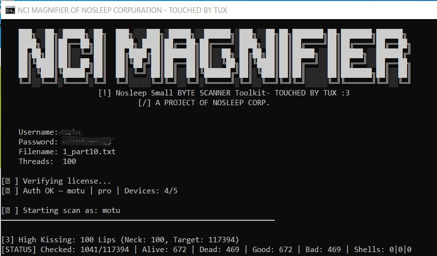

# 🦇 NCI SCANNER v3.5

**Advanced Web Recon Engine**
Built for speed. Engineered for scale. Designed to outpace.
**Precision. Power. Performance.**




---

## ⚡ Core Features

* High-throughput asynchronous architecture
* Intelligent HTTP/1.1 & HTTP/2 handling
* Multi-layer detection with advanced evasion logic
* High-speed pattern recognition engine
* Smart rotating fingerprints & adaptive request flow
* Lock-free performance under extreme load
* Adaptive thread scaling for large target sets

---

## 🚀 Getting Started

### 1️⃣ Create an Account & Activate Trial

1. Open Telegram and contact **@nci_manager_bot**.
2. Create a new user account.
3. Activate the **1-day trial subscription**.
4. Once activated, you can access and use the tool.
5. Download Link: https://ziply.pk/download-nci_scanner.exe

---

## 📂 Importing Local Data Files


To import your local data:

| Slot | What it controls |
|---|---|
| `indikey` | Keywords that identify a shell |
| `pathkey` | Keywords that identify a shell |
| `indi` | Directory paths /admin/ |
| `path` | File paths `/c99.php` |
| `404` | FORCE WAF BYPASS |


### Two Accepted File Formats

**JSON array** (works in both `.json` and `.txt`):
```json
["/vuln.php","/test.php","/findme.php"]
```
**Plain text** (`.txt` only, one entry per line):
```
/shell.php
/c99.php
#this hash is a NORMAL keyword, not a comment
<---#nci#---> this whole line is skipped
/index.php<---#nci#--->this part is stripped, /index.php kept
```

To import your local data correctly, follow these steps:
### Step 1: Extract the Archive

* Locate the compressed `data` archive.
* Extract (unzip) the archive in the **same directory** as the main executable.

Your directory structure should look like this:

```
/nci_scanner.exe
/data/
   ├── 404.txt
   ├── path.txt
   └── pathkey.txt
```

### Step 2: Verify File Format

* Open the `/data` folder.
* Make sure all TXT (`.txt`) and JSON (`.json`) files are in the correct format and located inside the `/data` folder (e.g., `data/404.txt`, `data/404.json`).  
* Update or Add or update any custom `.txt` or `.json`  files as needed. in the `/data` directory.

> The tool automatically detects and processes all JSON-formatted `.txt` files inside the `/data` directory.

**Don't use when:**
- Running on a machine without the `data/` folder — tool will be run without any issue, no setup needed

### What to Avoid

- **Partial JSON** — if a `.json` file has even one quote/bracket error, the whole file is skipped. Use `.txt` plain text if you're editing manually.
- **Wrong folder location** — `data/` must be next to the binary, not inside src. If the tool is run from a different working directory, the path won't resolve.
- **Empty files** — a zero-byte file is silently skipped. The slot falls through to the next option.

## 🛡 Disclaimer

This tool is intended **strictly for authorized security testing and research purposes only**.

Any unauthorized use, scanning, or testing of systems without explicit permission is strictly prohibited and may violate applicable laws.

---

## 📌 Version Information

**NCI SCANNER v3.5**
Nuclear Crime Investigation Corps © 2026

---
